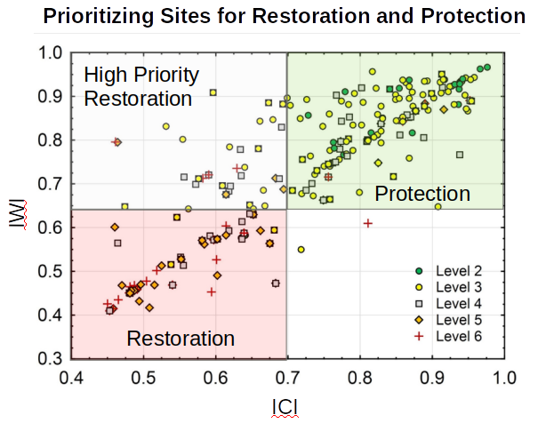

# CT Critical Freshwater Habitat

A recent [United Nations report](https://www.ipbes.net/global-assessment-biodiversity-ecosystem-services)
by the Intergovenmental Science-Policy Platform on Biodiversity and Ecosystem Services (2019) 
documented a disturbing trend of an unprecedented rapid decline in biodiversity around the world over the past 50 years.
This loss is a direct result of human-driven drivers, such as land-use change, climate change and direct harvest of 
species. A key recommendation for future policy decisions is to better integrate resource manage and landscape
planning across scales.

*Salvelinus fontinalis* (eastern wild brook trout) are one of very few native cold water fish species in the 
State of Connecticut (CT) (Beauchene et al. 2014).  Cold water fish populations are under great threat in 
the CT due to stream flow and temperature modification caused by land use, fragmented populations from dams and 
culverts, climate change and introduction of exotic species ([Eastern Brook Trout Venture](https://easternbrooktrout.org/), 2019).

This project conducts a landscape level analysis to identify streams with 
current and historic wild brook trout populations in CT and prioritize stream management strategies based
on the index of watershed integrity (IWI) and index of 
catchment integrity (ICI) developed by Flotemersch et al. (2016) and mapped by Thornbrugh et al. (2018).
Watershed integrity is the capacity of a watershed to support and maintain the full range of ecological processes and 
function essential to sustainability.  The IWI and ICI provide a watershed and localized catchment index, respectively, 
of six ecological processes and functions:  hydrologic regulation, regulation of water chemistry, sediment regulation, 
hydrologic connectivity, temperature regulation, and habitat provision.  The index is a collective measure of the 
degree to which human-related alterations have affected these ecological processes and functions.
The index ranges from 0 to 1 where 0 is a maximum impacted site and 1 is an unaltered site.

I use a recently proposed conceptual framework for prioritizing site restoration and protection (Stamp et al. 2018)
that averages IWI and ICI for a given stream catchment containing for wild brook trout streams. Stream catchments 
with a low IWI and ICI are degraded and are targeted for restoration as are sites with a high IWI but low ICI.
sites with a high IWI but low ICI are also targeted for restoration, but with a high priority because 
there is indication that the alteration is coming from a small nearby localized area. Sites with both high IWI and high ICI
are targeted for protection with a high priority to maintain the current habitat. 

*ICI - IWI Site Prioritization Example (Stamp Et Al 2018)*

Anticipated deliverables include:
* an interactive map displaying stream sites with sampled high density wild brook trout populations
and stream catchments displaying suggested management strategies based on watershed and catchment integrity
* a static map available for download
* a geojson of stream catchments and attributes
* an informative website with embedded maps and links to references

## References
Mike Beauchene, Mary Becker, Christopher J. Bellucci, Neal Hagstrom & Yoichiro Kanno (2014) Summer Thermal Thresholds 
of Fish Community Transitions in Connecticut Streams, North American Journal of Fisheries Management, 
34:1, 119-131, DOI: 10.1080/02755947.2013.855280 

CT Department of Energy and Environmental Protection. 2016.  Methodology for
defining preliminary stream flow classifications pursuant to sections
26-141B-1 TO 26-141B-8 of the regulations of Connecticut State Agencies.  Hartford, CT.

Eastern Brook Trout Join Venture Website.  Accessed 14 June 2019.
[https://easternbrooktrout.org/](https://easternbrooktrout.org/)

Flotemersch, J. E., Leibowitz, S. G., Hill, R. A., Stoddard, J. L., Thoms, M. C., and Tharme, R. E. (2016) 
A Watershed Integrity Definition and Assessment Approach to Support Strategic Management of Watersheds. 
River Res. Applic., 32: 1654– 1671. doi: 10.1002/rra.2978. 

Hill, Ryan A., Marc H. Weber, Scott G. Leibowitz, Anthony R. Olsen, and Darren J. Thornbrugh (2016) 
The Stream-Catchment (StreamCat) Dataset: A Database of Watershed Metrics for the Conterminous United States. 
Journal of the American Water Resources Association (JAWRA) 52:120-128. DOI: 10.1111/1752-1688.12372.

IPBES (2019) Global assessment report on biodiversity and ecosystem services of the Intergovernmental Science- 
Policy Platform on Biodiversity and Ecosystem Services. E. S. Brondizio, J. Settele, S. Díaz, and H. T. Ngo (editors). 
IPBES Secretariat, Bonn, Germany.

Stamp, Jen, Anna Hamilton, and Mike Paul (2018) Prioritizing stream sites for restoration and conservation.
New England Association of Environmental Biologists Conference Presentation.  Devens, MA.
http://www.neaeb.org/past-conference

Darren J. Thornbrugh, Scott G. Leibowitz, Ryan A. Hill, Marc H. Weber, Zachary C. Johnson, Anthony R. Olsen, 
Joseph E. Flotemersch, John L. Stoddard, David V. Peck (2018) Mapping watershed integrity for the conterminous 
United States. Ecological Indicators 85:1133-1148. https://doi.org/10.1016/j.ecolind.2017.10.070.

## Data Sources
CT DEEP Connecticut Stream flow Classifications - Wild Brook Trout Attribute, Accessed June 2019
* [Metadata](http://www.cteco.uconn.edu/metadata/dep/document/final_streamflow_classifications_fgdc_plus.htm)
* [Shapefile](https://www.ct.gov/deep/cwp/view.asp?a=2701&q=323444&deepNav_GID=1636)

CT DEEP Monitoring and Assessment Program and Inland Fisheries Program Fish Survey Data 1989 - 2017

[NHD Plus Version 2](http://www.horizon-systems.com/NHDPlus/NHDPlusV2_home.php), Accessed June 2019

[EPA StreamCat Dataset](https://www.epa.gov/national-aquatic-resource-surveys/streamcat), Accessed June 2019

